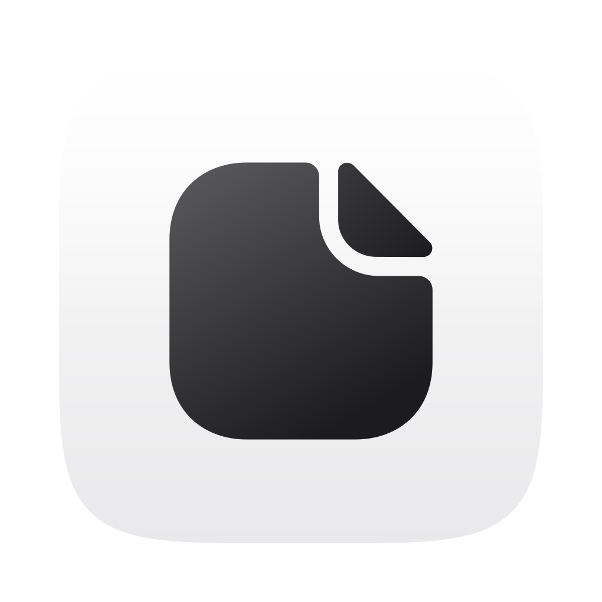

<div align="center">



# Bufferly

**普通 macOS 用户的本地优先剪贴板助手**

<sub>A local-first clipboard assistant for everyday Mac users</sub>

<br/>


[](LICENSE)
[](https://github.com/Innate-Labs/bufferly)

<br/>
<br/>

[](https://github.com/Innate-Labs/bufferly/releases/latest)

<sub>最新版本见 <a href="https://github.com/Innate-Labs/bufferly/releases/latest">Releases</a></sub>

</div>

---

复制过的文字、链接、图片、文件，Bufferly 自动帮你留住，随时**能搜到、能找回、能安全粘贴**。一切只存在你自己的 Mac 上，**不上传任何剪贴板内容**，敏感内容自动保护——用起来就像系统自带的功能一样自然。

## ✨ 特性

- 📋 **自动记住 + 去重** —— 复制即保存，呼出瞬间补抓，最新的永远在第一张
- 🔍 **模糊搜索** —— 记得一两个词就能搜到，打错字也行
- 🎴 **卡片式历史墙** —— 横向卡片按类型着色，来源 App 图标一眼可辨
- 🏷️ **自动类型识别** —— 链接、图片、文件、邮箱、验证码等自动归类
- 🖼️ **不止文本** —— 图片、文件、富文本都能存、能预览、能原样粘回
- 🔒 **敏感内容自动保护** —— 密码、验证码、密钥等命中后脱敏或不保存
- 📌 **固定常用内容** —— 常贴的地址、话术、链接固定到独立分区，随取随用
- ⚡ **Return 执行** —— 可只复制到剪贴板，也可复制后粘贴到上一应用
- 🛡️ **排除 App** —— 默认不记录 Passwords、Keychain Access、1Password、Bitwarden 等敏感来源
- 🎨 **原生 macOS 26 体验** —— Apple Liquid Glass、语义色、Hugeicons 图标，支持 Light / Dark、Reduce Motion

## ⌨️ 快捷键

| 操作 | 快捷键 |
|---|---|
| 呼出 / 隐藏面板 | `⌥ Space`（可在设置中更改） |
| 选择上一张 / 下一张 | `←` `→`（或 `↑` `↓`） |
| 粘贴选中 | `Return` |
| Quick Look 预览 | `Space`（搜索为空时） |
| 仅复制后关闭 | `⌥ Return` |
| 固定 / 取消固定 | `⌘P` |
| 删除选中 | `⌘⌫` |
| 切换 剪贴板 / 已固定 | `⌘1` / `⌘2` |
| 清空搜索 / 关闭面板 | `Esc` |

## 📦 安装

### 直接用（DMG）

1. 到 **[Releases 页面](https://github.com/Innate-Labs/bufferly/releases/latest)** 下载最新的 `Bufferly-x.y.z.dmg`
2. 打开 DMG，把 Bufferly 拖到「应用程序」
3. **首次启动右键「打开」**（未公证，需绕过一次 Gatekeeper）

> 需要 **Apple Silicon + macOS 26 (Tahoe)**。

### 从源码构建

```bash
git clone https://github.com/Innate-Labs/bufferly.git
cd bufferly

swift run Bufferly            # 开发运行
bash scripts/build-app.sh     # 打包 .app → .build/Bufferly.app
bash scripts/install-app.sh   # 覆盖安装到 /Applications 并启动
bash scripts/build-dmg.sh     # 打包 .dmg → .build/Bufferly.dmg
```

> **复制后粘贴到上一应用**依赖辅助功能权限：系统设置 → 隐私与安全性 → 辅助功能 → 允许 Bufferly。未授权也能用，内容已写回剪贴板，自己按 `⌘V` 即可。

### 首次授权和排障

- 如果点击「请求授权」没有弹窗：打开 Bufferly 设置 → 粘贴行为 →「打开系统设置」，在「隐私与安全性 → 辅助功能」里允许 Bufferly。
- 如果已经授权但仍显示需要授权：先关闭再重新打开辅助功能里的 Bufferly 开关，然后回到 Bufferly 设置点「刷新」。
- 如果还是不生效：退出 Bufferly，重新从 `/Applications/Bufferly.app` 启动，确认授权的是这个应用路径，而不是 `.build/Bufferly.app`。
- 没有辅助功能权限时，Return 会退回为只复制到剪贴板，不会丢失内容。

## 🔒 隐私

- 剪贴板历史**只存本地** SQLite：`~/Library/Application Support/Bufferly/`
- **不做云同步、不上传任何内容**
- 设置页会明确显示保留时长、最大历史数量和当前排除的 App
- 默认排除 Passwords、Keychain Access、1Password、Bitwarden 等敏感 App
- 敏感内容默认保护，可选脱敏占位或直接丢弃
- 链接预览默认**关闭**（开启才联网获取标题/图标）

## 🛠️ 技术栈

Swift · SwiftUI · AppKit · [GRDB](https://github.com/groue/GRDB.swift) / SQLite · Keychain

## 🗺️ 路线图

已完成核心剪贴板能力 + 图片/文件/富文本 + 模糊搜索。下一步重点是让普通用户开箱即用：更贴近日常的类型识别、隐私控制、安装体验、可靠性和高频交互手感。详见 **[ROADMAP.md](ROADMAP.md)**。

## 🤝 贡献

欢迎 issue 与 PR。设计规范见 [`DESIGN.md`](DESIGN.md)，项目说明见 [`CLAUDE.md`](CLAUDE.md)。

## 📄 License

[MIT](LICENSE) © [Innate Labs](https://github.com/Innate-Labs)

<div align="center"><sub>Built for everyone who copies things every day.</sub></div>
